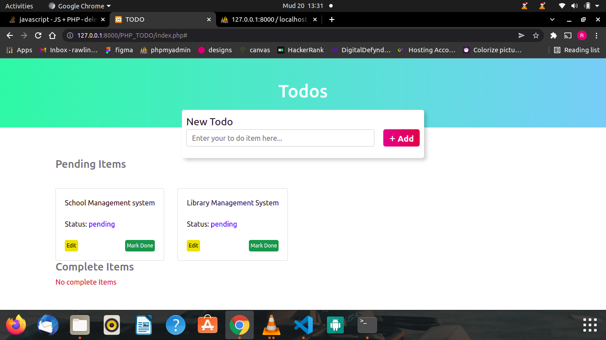

### TO DO LIST
 To do list with php
 ### Screenshort
 
 ## SET UP
 To set up you will need a server. FOR this i used xampp server. Database name todoitems.
 You can import the tables here from an sql file have included here.
 Altanatively you can create the table called New_Items, with rows (Item_Id,Items_name,Item_status).
 all their types are VARCHAR.